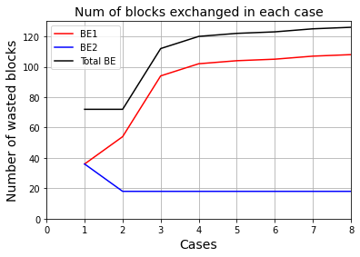

<!-- PROJECT LOGO -->
<br />
<p align="center">
  <h3 align="center">Decentralized Federated Learning</h3>

  <p align="center">
    This project aims to build a blockchain based decentralized federated learning
    <br />
  </p>
  <br />

  <p align="center">
  
  <br />
  </p>
  
</p>


 

<!-- TABLE OF CONTENTS -->
<details open="open">
  <summary>Table of Contents</summary>
  <ol>
    <li>
      <a href="#about-the-project">About The Project</a>
    </li>
    <li>
      <a href="#getting-started">Getting Started</a>
      <ul>
        <li><a href="#prerequisites">Prerequisites</a></li>
        <li><a href="#installation">Installation</a></li>
      </ul>
    </li>
    <li><a href="#usage">Usage</a></li>
    <li><a href="#license">License</a></li>
    <li><a href="#contact">Contact</a></li>
  </ol>
</details>


<!-- ABOUT THE PROJECT -->
## About The Project
Recently, Federated Learning (FL) has gained tremendous traction as it has the ability to provide a privacy-preserving mechanism to train Machine Learning models on hidden data. However, most of today's FL systems are centralized, in which a centralized server is typically used to build the global FL model. 


<p align="center">
  
  <br />
</p>

<!-- GETTING STARTED -->
## Getting Started

The following instructions will show you how to setup and installed required packages.

### Prerequisites

The only requirements is to have python3 and pip installed in your machine.

### Installation

1. Download and Install MongoDB Comunity Server from [https://www.mongodb.com/try/download/community](https://www.mongodb.com/try/download/community)

#### Installation virtualenv for Windows
2. Install virtualenv.
  ```sh
  py -m pip install --user virtualenv
```
   
3. Create and activate an environment called dfl
  ```sh
  py -m venv dfl

  .\dfl\Scripts\activate
```

#### Installation virtualenv for Unix/macOs
2. Install virtualenv.
  ```sh
  python3 -m pip install --user virtualenv
```
   
3. Create and activate an environment called dfl
  ```sh
  python3 -m venv dfl

  source dfl/bin/activate
```

#### Installation the dFL library
4. Install dFL library using pip
  ```sh
  pip install dFL
```

<!-- USAGE EXAMPLES -->
## Usage

Use this space to show useful examples of how a project can be used. Additional screenshots, code examples and demos work well in this space. You may also link to more resources.

_For more examples, please refer to the [Documentation](https://example.com)_


<!-- LICENSE -->
## License

Distributed under the MIT License. See `LICENSE` for more information.


<!-- CONTACT -->
## Contact
Ahmed Mukhtar Dirir -  ahmed.m.dirir@gmail.com


